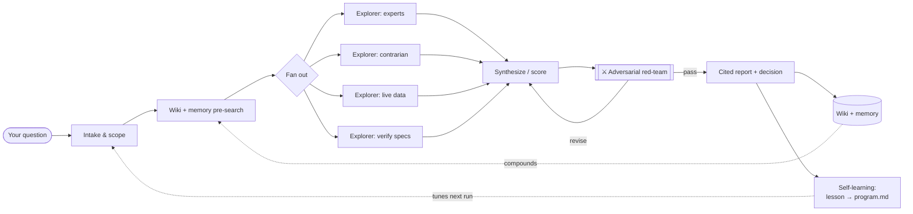

<div align="center">


<br/>

**Six battle-tested plugins that turn Claude Code into a research & decision machine.**
One-command install · works in Claude Code, Cursor & Codex · free & MIT.

<br/>

<!-- live social proof -->
[](https://github.com/justsima/agentic-stack/stargazers)
[](https://github.com/justsima/agentic-stack/network/members)
[](https://hits.sh/github.com/justsima/agentic-stack/)
[](traffic/REPORT.md)

[](https://github.com/justsima/agentic-stack/commits/main)
[](https://github.com/justsima/agentic-stack/issues)
[](https://github.com/justsima/agentic-stack)
[](LICENSE)
[](https://claude.com/claude-code)
[](#-contributing)

[**🚀 Quick start**](#-quick-start) · [**🧩 Plugins**](#-the-plugins) · [**🧠 How it works**](#-how-it-works) · [**📊 Analytics**](#-analytics--traffic) · [**🌐 Cross-tool**](#-other-tools-curs--codex)

</div>

---

## ✨ Why agentic-stack?

Most "AI skills" are a single clever prompt. **These are full multi-agent pipelines** with the engineering that separates a demo from a tool:

- 🧪 **Evidence in, judgment out.** Research runs split *evidence-gathering* (parallel sub-agents) from *judgment* (a **deterministic Python scoring engine** for product decisions, an **adversarial red-team** for research). The conclusion is grounded — not vibes, not a hallucinated ranking.
- 🔁 **They get smarter.** `ultradeep` writes a transferable lesson back into its own `program.md` after every run. Your tooling compounds.
- 🗂️ **They compound into a knowledge base.** Reports file themselves into an optional Obsidian wiki, cross-linked and searchable next time.
- 🛡️ **Privacy-first by design.** Ships the *engine*, never your data. No secrets, no personal content — your wiki/memory start as empty scaffolds.
- ⚡ **Zero-to-running in one command.** An interactive installer wires the free MCP servers and asks what you want. Required pieces are free and key-less.

> Built by [**@justsima**](https://github.com/justsima) — the agentic research workflow behind real deep-research, buying decisions, and high-stakes calls, packaged so you can run it too.

---

## 🧩 The plugins

| | Plugin | What it gives you | Try it |
|---|---|---|---|
| 🔬 | **ultradeep** | Multi-agent **deep research**: 8–10 parallel explorers → STORM-style questioning → **adversarial red-team** → tiered search (Exa / SearXNG / WebSearch) → cited, wiki-filed report. Self-tunes via `program.md`. | `/ultradeep <hard question>` |
| 🛒 | **market-scout** | **"Best X on the market"** across Amazon/Best Buy/Walmart/Newegg. Parallel explorers + a **deterministic decision-matrix engine** + red-team → a ranked, segment-aware buying report. | `/market-scout best <product>` |
| 🏛️ | **llm-council** | A decision through **5 advisors, each a distinct reasoning method** (inversion, decomposition, analogy, naive questioning, dependency graphing) → anonymized peer review → chairman synthesis. | `/llm-council <decision>` |
| 🧠 | **adhd** | **Divergent ideation** — N isolated idea branches under different cognitive frames, scored, pruned, deepened. Beats one-shot brainstorming on open-ended problems. | `/adhd <open problem>` |
| 📝 | **job-application-helper** | Natural, tailored application answers from **your own** profile (a private, git-ignored `profile.md` you create from the template). | shares a JD → drafts answers |
| 🛡️ | **agentic-config** | Safety **hooks** (block dangerous bash, block secret leaks), a session-context hook, a verify-before-stop hook + a recommended-settings fragment. No secrets. | auto-loads |

---

## 🎬 In action

```text
You ▸ /market-scout best 5G router

agentic-stack ▸ dispatching explorers… (expert reviews · contrarian/reliability · live prices)
              ▸ scoring 7 candidates across 4 weight profiles (deterministic MCDA)
              ▸ red-team: PASS-with-revisions (caught 2 inflated ratings, 1 missing candidate)

🏆 No single winner — 4 picks by use case:
   • Whole-home   → Ubiquiti UDR-5G-Max ($499)
   • Mobile (AT&T)→ NETGEAR Nighthawk M7 Pro ($449, locked)
   • Travel/eSIM  → NETGEAR Nighthawk 5G M7 ($499)   ← carrier-free pick
   • Value/control→ GL.iNet Puli AX ($379, OpenWrt+VPN)
   ▸ filed → wiki/research-reports/best-5g-router-2026.md
```

<sub>💡 Want a real demo GIF here? Record with [asciinema](https://asciinema.org) or [vhs](https://github.com/charmbracelet/vhs) and drop it in `assets/`.</sub>

---

## 🧠 How it works



The loop is the point: **pre-search → fan-out → verify → file → learn**, and every run leaves the system a little sharper.

---

## 🚀 Quick start

```bash
git clone https://github.com/justsima/agentic-stack.git
cd agentic-stack
./install.sh
```

The installer is interactive, idempotent, and `sudo`-free. It auto-wires the **required** (free, key-less) MCP servers — **Exa · agentmemory · Context7** — asks about optional ones (SearXNG, Jina, the claude-obsidian wiki engine, graphify), and creates an empty wiki scaffold.

<details>
<summary><b>Prefer the in-app plugin marketplace?</b></summary>

```text
/plugin marketplace add justsima/agentic-stack
/plugin install ultradeep@agentic-stack
/plugin install market-scout@agentic-stack
/plugin install llm-council@agentic-stack
/plugin install adhd@agentic-stack
/plugin install agentic-config@agentic-stack
```
Then add the required MCP servers:
```bash
claude mcp add --scope user --transport http exa https://mcp.exa.ai/mcp
claude mcp add --scope user agentmemory -- npx -y @agentmemory/agentmemory
claude mcp add --scope user --transport http context7 https://mcp.context7.com/mcp
```
</details>

<details>
<summary><b>Other flags</b></summary>

```bash
./install.sh --dry-run   # show everything it would do, change nothing
./install.sh -y          # non-interactive: required = yes, optional = no
./install.sh --help
```
</details>

**Requirements:** Claude Code · `node`/`npx` (for agentmemory) · Docker *(optional, for SearXNG)*.

---

## 📊 Analytics & traffic

Everything you need to measure reach — and the honest truth about each metric:

| Signal | How it's tracked | Where |
|---|---|---|
| ⭐ **Stars / forks** | Live shields.io badges | top of this README |
| 👁️ **README views** | Live [hits.sh](https://hits.sh) counter badge | top of this README |
| ⬇️ **"Downloads" (git clones)** | **Self-archived daily** by a GitHub Action (GitHub deletes traffic after 14 days) | [`traffic/REPORT.md`](traffic/REPORT.md) |
| 📈 **Clones + views history** | Permanent CSVs, upserted daily | [`traffic/views.csv`](traffic/views.csv) · [`traffic/clones.csv`](traffic/clones.csv) |
| 🌟 **Star growth over time** | star-history (live, below) | [chart](#-star-history) |
| 🔥 **Contributor/issue/PR activity** | Repobeats embed *(activate once — see below)* | this section |

> **Why a self-hosted archiver?** GitHub has **no plugin-install counter**, and native traffic (views + clones) **vanishes after 14 days**. The bundled [`.github/workflows/analytics.yml`](.github/workflows/analytics.yml) snapshots views + clones every day into `traffic/`, turning that 14-day window into a permanent record. Runs automatically; works with the built-in token (add a `GH_TRAFFIC_TOKEN` PAT secret if your account 403s the traffic API).

<details>
<summary><b>Activate the Repobeats activity graph (30 seconds)</b></summary>

1. Go to **[repobeats.axiom.co](https://repobeats.axiom.co)** → add `justsima/agentic-stack`.
2. Paste the snippet it gives you here:
   ```html
   
   ```
</details>

---

## 🧪 The science behind it

These aren't arbitrary — each pattern is grounded in published work:

- **ultradeep** — Anthropic's multi-agent Research, Stanford **STORM** (perspective questioning), GPT-Researcher (plan→fan-out→synthesize), adversarial verification.
- **market-scout** — classic **MCDA** (multi-criteria decision analysis): min-max normalization + weighted scoring + value-per-dollar, so the ranking is reproducible.
- **llm-council** — Karpathy's *LLM Council* + **DMAD** (ICLR 2025): distinct reasoning methods beat distinct personas.
- **adhd** — isolated parallel branches + separated generate/critique phases to fight premature convergence.

---

## 🔧 Tuning

- **ultradeep:** edit `~/.claude/deep-research/program.md` (seeded by the installer) — priorities, depth, source policy, search backends. Its **Domain Notes** section grows itself.
- **market-scout:** edit `plugins/market-scout/skills/market-scout/references/criteria.json` — add product categories + weight profiles (`default` / `value` / `performance` / `travel`).

---

## 🌐 Other tools (Cursor / Codex)

The skills use the open **Agent Skills** `SKILL.md` standard. See [`skills-portable/`](skills-portable/README.md):

```bash
./skills-portable/sync-skills.sh ~/.agents/skills   # e.g. Codex
```

---

## 🔒 Privacy & security

- **No secrets, no personal data** ship here. Free MCP endpoints need no keys; agentmemory runs locally.
- Your **wiki & memory are empty scaffolds** — the engine, not anyone's data.
- `job-application-helper` reads a **git-ignored** `profile.md` you create locally.
- Safety **hooks** block destructive bash + secret leaks. Full notes: [`docs/SECURITY.md`](docs/SECURITY.md).

---

## 🗺️ Roadmap

- [ ] Real demo GIFs per plugin
- [ ] More `market-scout` categories (TVs, headphones, monitors, GPUs)
- [ ] `ultradeep` knowledge-graph view
- [ ] Submit to public Claude Code plugin directories
- [ ] One-click cross-tool installer for Cursor & Codex

Ideas? [Open an issue](https://github.com/justsima/agentic-stack/issues) 🙌

---

## 🤝 Contributing

PRs welcome! Add a plugin under `plugins/<name>/` with a `.claude-plugin/plugin.json`, list it in `.claude-plugin/marketplace.json`, and run `claude plugin validate .`. Keep the privacy rule sacred: **ship the engine, never the data.**

---

## ⭐ Star history

<div align="center">

[](https://star-history.com/#justsima/agentic-stack&Date)

**If this saves you time, a ⭐ helps others find it.**

</div>

---

<div align="center">

**MIT** © [justsima](https://github.com/justsima) · Companion tools (claude-obsidian, graphify, agentmemory) are separate open-source projects.

<sub>Built with Claude Code 🤖</sub>

</div>
